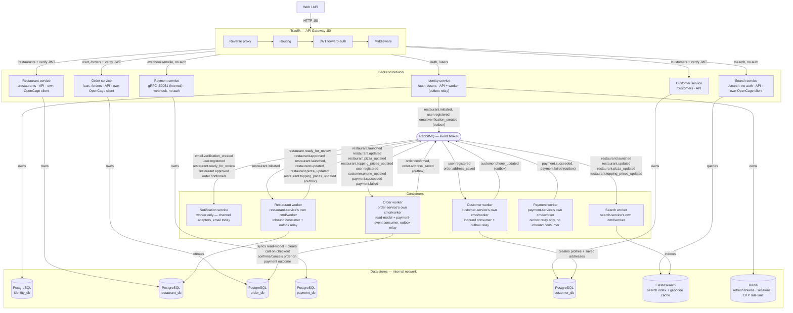

# Architecture

This diagram describes the current system architecture, service boundaries, communication patterns, security model, and infrastructure design of the platform.

- **`identity-service` outboxes every event it raises** (`restaurant.initiated`, `user.registered`, `email.verification_created`). It's also the only service enforcing request-level abuse protection today: a per-email cooldown and a per-code attempt cap on OTP verification, both backed by the same Redis instance used for refresh tokens.
- **`restaurant-service` uses the outbox pattern too**, same full-scope shape as identity-service: it outboxes every event it raises. The relay runs as a goroutine inside the restaurant worker (`cmd/worker`), next to the inbound `restaurant.initiated` consumer — the restaurant API never talks to RabbitMQ directly.
- **`search-service` has no Postgres database** — its only store is Elasticsearch, which doubles as the search index and a disposable geocode cache (a second index, unrelated to search, safe to delete anytime since a cache miss just re-populates it) behind a `CachingGeocoder` decorator wrapping its OpenCage client.
- **`notification-service` is a pure event-to-notification pipeline** — one handler per consumed event, dispatching through a channel-agnostic `Sender` interface (email today, via `text/template` + SMTP; a second channel would be a new adapter behind the same interface). It holds no state of its own beyond what's in each event's payload, so it needs no database.
- **`order-service` owns the customer's cart and order lifecycle**, backed by its own Postgres (`order_db`) and a Postgres-backed geocode cache for delivery-address checks. Checkout/cancel call payment-service over gRPC (`CreatePayment`/`CancelPayment`/`GetPaymentStatus`, behind a circuit breaker); its worker confirms/cancels orders on `payment.succeeded`/`payment.failed` and relays its own `order.confirmed` and `order.address_saved` outbox events.
- **`payment-service` processes payments via Mollie**, generic on `subject_type`/`subject_id`, not tied to order-service's concept of an order. Its primary surface is **gRPC** (internal only, `:50051`); its one HTTP route, `/webhooks/mollie`, never trusts the POSTed body — it always re-fetches true status from Mollie. The payment worker is the only worker with no inbound consumer — it only publishes `payment.succeeded`/`payment.failed`.
- **`customer-service` owns a customer's phone and saved delivery addresses**, backed by its own Postgres (`customer_db`). Name and email are a read-only mirror of identity-service, created by consuming `user.registered`. Addresses have no create endpoint: the customer worker creates them from order-service's `order.address_saved`, so nothing that didn't pass a real checkout can be saved. `PATCH /customers/me/phone` publishes `customer.phone_updated` through its outbox, which order-service consumes to use as the delivery contact number. The customer worker runs an inbound consumer and an outbox relay side by side.
