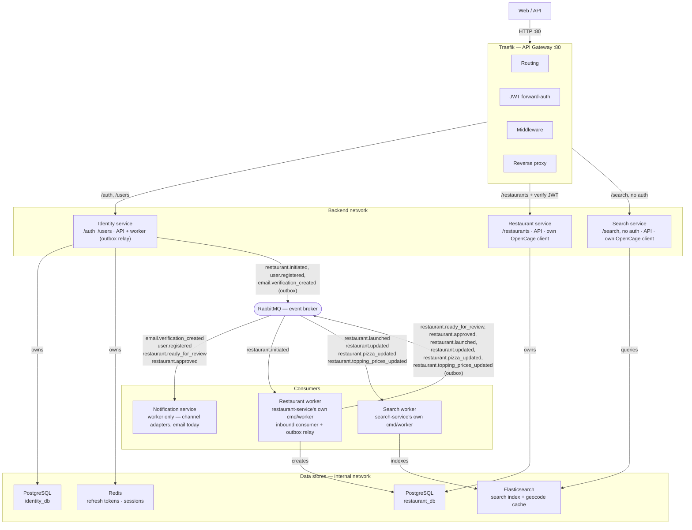

# Architecture

This diagram describes the current system architecture, service boundaries, communication patterns, security model, and infrastructure design of the platform.

- **`identity-service` outboxes every event it raises** (`restaurant.initiated`, `user.registered`, `email.verification_created`) — no best-effort publish path left in that service.
- **`restaurant-service` uses the outbox pattern too**, same full-scope shape as identity-service: it outboxes every event it raises. The relay runs as a second goroutine inside `RW` (`cmd/worker`), alongside the existing inbound `restaurant.initiated` consumer — `RS` (the API) never talks to `BROKER` directly.
- **`search-service` has no Postgres database** — its only store is Elasticsearch, which doubles as the search index and a disposable geocode cache (a second index, unrelated to search, safe to delete anytime since a cache miss just re-populates it).
- **`notification-service` is a pure event-to-notification pipeline** — one handler per consumed event, dispatching through a channel-agnostic `Sender` interface (email today, via `text/template` + SMTP; a second channel would be a new adapter behind the same interface). It holds no state of its own beyond what's in each event's payload, so it needs no database.
