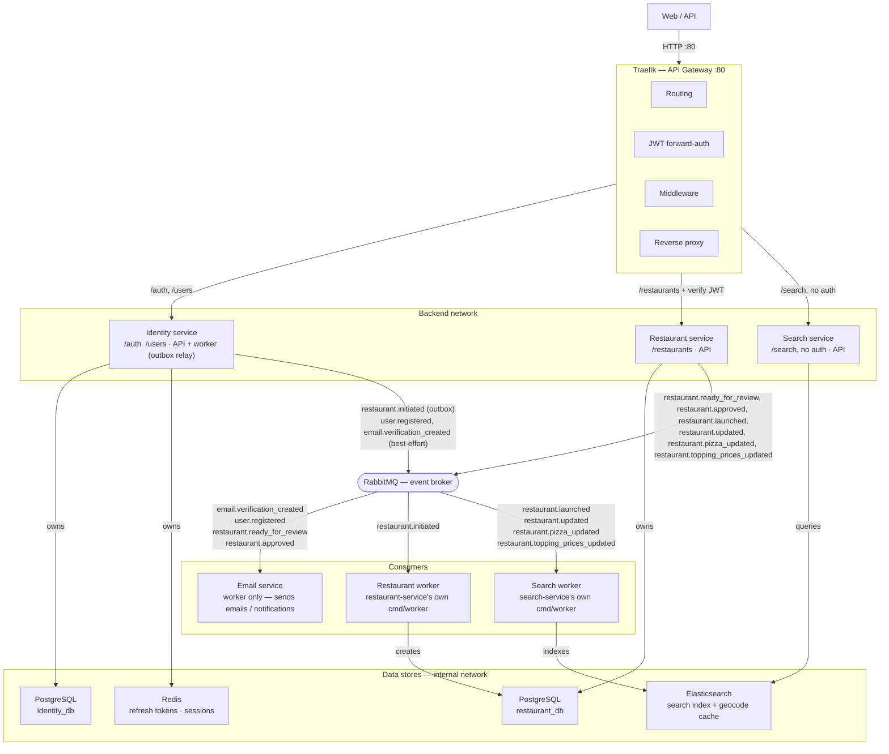

# Architecture

This diagram describes the current system architecture, service boundaries, communication patterns, security model, and infrastructure design of the platform.

- **`restaurant-service` does not use the outbox pattern** — unlike `identity-service`, its RabbitMQ publisher is called directly/best-effort from the same request that mutates the `restaurants` row, for every event it raises.
- **`restaurant.reactivated`/`restaurant.deactivated`** are defined nowhere yet — `Restaurant.Deactivate`/`Reactivate` don't exist as domain methods, so nothing publishes them and `search-service` has no corresponding delete/de-index path. `restaurant.rejected` doesn't exist either — only `Approve`/`Launch` are implemented on the status workflow so far, no `Reject`.
- **Both `restaurant-service` and `search-service` call OpenCage geocoding independently** — separate API clients, separate quotas, not shared. Not shown above since the diagram scopes to internal services/stores/broker, not external APIs.
- **`search-service` has no Postgres database** — its only store is Elasticsearch, which doubles as the search index and a disposable geocode cache (a second index, unrelated to search, safe to delete anytime since a cache miss just re-populates it).
