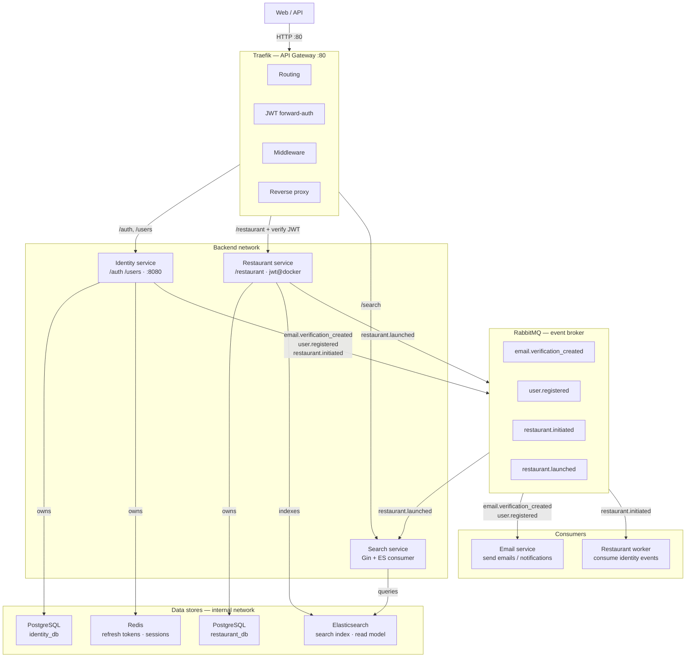

# Architecture

This document describes the current system architecture, service boundaries, communication patterns, security model, and infrastructure design of the platform.

```mermaid
flowchart TD
  CLIENT["Web / API"]

  subgraph GW["Traefik — API Gateway :80"]
    direction LR
    ROUTE["Routing"]
    JWT["JWT forward-auth"]
    MW["Middleware"]
    RP["Reverse proxy"]
  end

  subgraph BACKEND["Backend network"]
    IS["Identity service\n/auth  /users · :8080"]
    RS["Restaurant service\n/restaurant · jwt@docker"]
    SS["Search service\nGin + ES consumer"]
  end

  subgraph BROKER["RabbitMQ — event broker"]
    direction LR
    E1["email.verification_created"]
    E2["user.registered"]
    E3["restaurant.initiated"]
    E4["restaurant.launched"]
  end

  subgraph CONSUMERS["Consumers"]
    EMAIL["Email service\nsend emails / notifications"]
    RW["Restaurant worker\nconsume identity events"]
  end

  subgraph STORES["Data stores — internal network"]
    direction LR
    PGI["PostgreSQL\nidentity_db"]
    PGR["PostgreSQL\nrestaurant_db"]
    REDIS["Redis\nrefresh tokens · sessions"]
    ES["Elasticsearch\nsearch index · read model"]
  end

  CLIENT -->|HTTP :80| GW
  GW -->|"/auth, /users"| IS
  GW -->|"/restaurant + verify JWT"| RS
  GW -->|"/search"| SS

  IS -->|owns| PGI
  IS -->|owns| REDIS
  RS -->|owns| PGR
  RS -->|indexes| ES

  IS -- "email.verification_created\nuser.registered\nrestaurant.initiated" --> BROKER
  RS -- "restaurant.launched" --> BROKER

  BROKER -- "email.verification_created\nuser.registered" --> EMAIL
  BROKER -- "restaurant.initiated" --> RW
  BROKER -- "restaurant.launched" --> SS

  SS -->|queries| ES
```
