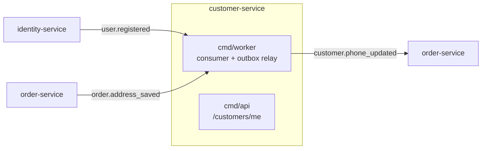

# customer-service — technical overview

Owns a customer's own data: a phone number and their saved delivery addresses. Name and email live in identity-service and are mirrored here read-only. Like order-service, it owns its own Postgres database, runs an inbound RabbitMQ consumer and a transactional outbox relay side by side in `cmd/worker`, and never calls another service synchronously.

**Current state**: profile (`GET`/`PATCH phone`) and saved addresses (`GET`/`DELETE`/set default) are built and live. Saved payment methods and notification preferences are not part of this service: payment-service has no saved-card or mandate concept, and notification-service has a single email channel, so a preferences toggle would control nothing.

## Service context



## Layered architecture

```
cmd/api                              → Gin HTTP server: /customers/me, /customers/me/phone,
                                        /customers/me/addresses[/:id[/default]]
cmd/worker                           → RabbitMQ consumer (identity.events + order.events) + outbox relay,
                                        two goroutines side by side, each with its own panic recovery
internal/domain/customer             → Customer, Address + their repository interfaces,
                                        EventDispatcher/EventHandler/EventPayload (inbound event contracts)
internal/domain/outbox               → OutboxEvent/OutboxStatus/OutboxRepository
internal/application/customer        → schema.go, mapper.go, events.go (PhoneUpdatedPayload),
                                        dispatcher.go (EventDispatcher impl), commands/UpdatePhone,
                                        queries/GetProfile, handlers/{UserRegistered,AddressSaved}
internal/application/address         → schema.go (AddressResponse), mapper.go, commands/{Delete,SetDefault},
                                        queries/List
internal/application/outbox          → Worker/Relay
internal/infrastructure/persistence  → customer_repository.go, address_repository.go, outbox.go
internal/infrastructure/messaging    → RabbitMQ consumer + publisher
internal/infrastructure/db           → Postgres connection
internal/infrastructure/observability → per-request slog logger middleware + context helpers
internal/interfaces/http             → middleware (Auth only, no role gate), response.HandleError,
                                        validation, handlers/{CustomerHandler,AddressHandler},
                                        routes/{customer_routes.go,address_routes.go}
internal/container                   → shared.go / api.go / worker.go, manual DI
internal/shared/{errors,event}       → error sentinels, Event interface
```

Auth is enforced per route group in Gin (`Middleware.Auth`), reading the `X-User-ID`/`X-User-Role` headers Traefik injects after identity-service's forward-auth check. The Traefik router also carries the `jwt@docker` label, so a request with forged headers and no valid JWT is rejected at the gateway.

## Domain model

`Customer` is one entity with two writers. `id`, `email`, `first_name` and `last_name` come from the `user.registered` consumer (`Upsert` with `ON CONFLICT DO NOTHING`, since the event fires once per user); `phone` is set by the customer's own authenticated `PATCH`. It has no `created_at`, because nothing reads one.

`Address` holds `house`, `street`, `city`, `postal_code` (the same four fields, and JSON names, as order-service's checkout address), `is_default`, `created_at` and `updated_at`. There is no label, no lat/lon and no `PATCH`: an address is created from a checkout that already validated and geocoded it, and after that it is only deleted or made the default.

A partial unique index, `uq_customer_addresses_default (customer_id) WHERE is_default`, allows at most one default address per customer at the database level.

## Events

Consumed:

| Event | From | Handler | Effect |
|---|---|---|---|
| `user.registered` | identity-service | `UserRegistered` | Create the `customers` row |
| `order.address_saved` | order-service | `AddressSaved` | Create a saved address |

Published, through the outbox:

| Event | When | Consumed by |
|---|---|---|
| `customer.phone_updated` | `UpdatePhone` commits | order-service, to keep its customer mirror's phone current |

### Saving an address

`order.address_saved` carries `customer_id`, `house`, `street`, `city` and `postal_code`. `AddressSaved` first asks `ExistsForCustomer` whether the customer already has an address with exactly those five values; if so it logs a `Warn` and returns, so redelivery and repeated `saveAddress: true` checkouts create no duplicates. Otherwise it creates the address, marking it the default when the customer has none yet. A malformed payload or a repository error is returned to the consumer, which retries up to `MaxRetryAttempts` (3) before the message goes to `customer_queue.dlq`.

Addresses are created only this way. A client-facing `POST` would let anyone submit address text that never passed a real checkout, so none exists.

### Setting the default

`SetDefault` loads the address with `FindByID(id, customerID)`, which is the ownership check (the repository's `SetDefault(id)` is not customer-scoped), then runs `UnsetDefault` and `SetDefault` in a single transaction so the partial unique index is never violated. Deleting the default address leaves the customer with no default.

### Outbox

`UpdatePhone` writes the phone and the `customer.phone_updated` outbox row in one `db.Transaction`. The relay polls `pending` rows with `SELECT ... FOR UPDATE SKIP LOCKED`, publishes to the `customer.events` exchange, and retries with backoff up to `MaxRetries`. `FetchAndMarkProcessing` also reclaims `processing` rows whose `locked_until` lease has expired, so a worker crash mid-publish does not strand a row.

## Migrations

`001_create_customers` → `002_create_customer_addresses` → `003_create_outbox_events`, applied by the `migrate-customer` compose service (`migrate-customer-test` in the test profile).

## Testing conventions

`tests/` mirrors `internal/`. Commands and handlers that use a transaction (`UpdatePhone`, `SetDefault`) run against real Postgres with real repositories; the rest (`List`, `Delete`, `GetProfile`, the two event handlers) use `tests/testutil` repository mocks. The outbox worker and repository are tested against real Postgres, including the expired-lease reclaim.

HTTP handlers are tested end to end in `tests/interfaces/http/handlers/`. The tests build the real router with `routes.SetupRoutes`, real commands and queries, and the real `Middleware`, and send `X-User-ID`/`X-User-Role` headers, so route registration and auth are exercised too.

Run from the repo root with `make test-customer` (needs `make test-up` first), or inside the `customer-test` container per the root `CLAUDE.md`.
