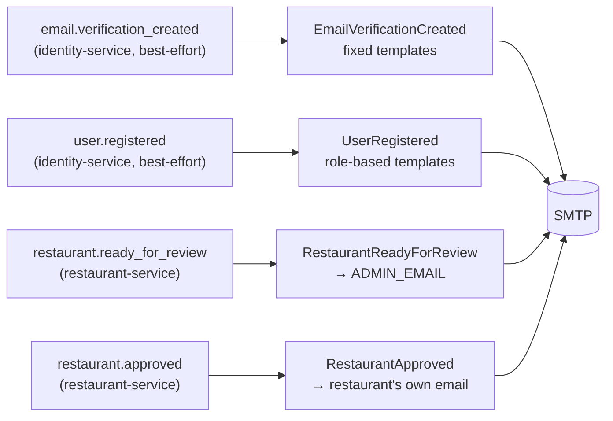

# email-service — technical overview

Sends transactional emails in response to RabbitMQ events published by `identity-service` and
`restaurant-service`. The simplest service in the repo: no database, no HTTP API, no `cmd/api`/`cmd/worker`
split — `cmd/main.go` is the only binary. Unlike identity-worker/restaurant-worker, it *is* started directly by
the root `compose.yaml`, since without it running the service simply never sends mail (no queue to drain into
a local store, no user-visible failure otherwise).

## Layered architecture

```
cmd/main.go                       → the only entrypoint; builds logger, container, calls messaging.Run
internal/domain/email             → Sender, TemplateLoader, EventDispatcher, EventHandler, EventPayload — interfaces only
internal/application/email        → one handler per consumed event: EmailVerificationCreated, UserRegistered,
                                    RestaurantReadyForReview
internal/infrastructure/email     → SMTP sender (net/smtp), text/template-based template loader
internal/infrastructure/messaging → RabbitMQ consumer (Run/runOnce as package-level functions)
internal/container                → wires Sender/TemplateLoader/handlers, registers them against routing keys
```

There is no persistence layer at all — every dependency is either an external call (SMTP) or a pure function
(template rendering), which is why this service's tests are all interface-mocked unit tests with no
`compose.test.yaml` entry.

## Domain model

Not an aggregate-owning service — the "domain" here is a small set of interfaces every handler depends on:

```go
type Sender interface         { SendEmail(to, subject, body string) error }
type TemplateLoader interface { Render(name string, data any) (string, error) }
type EventHandler interface   { Handle(event EventPayload) error }
type EventDispatcher interface {
    Register(eventName string, handler EventHandler)
    Dispatch(event EventPayload) error
}
```

`Sender` is implemented by a thin wrapper over `net/smtp.SendMail` with `PlainAuth` — no retry/circuit-breaking
of its own, since delivery retries happen one level up at the RabbitMQ consumer/DLX level. The raw SMTP message
is hand-assembled (`From`/`To`/`Subject`/`MIME-Version`/`Content-Type: text/plain; charset="UTF-8"`/
`Content-Transfer-Encoding: 8bit` headers, blank line, body) — `net/smtp.SendMail` does not add any of this.

`TemplateLoader` is implemented via `text/template.ParseFiles`, **not** `html/template`, despite the `.html`
filenames — every template is plain-text email content with no real markup, so HTML auto-escaping would be
pointless overhead rather than a safety net.

## Events consumed



| Event | Handler | Recipient | Templates |
|---|---|---|---|
| `email.verification_created` | `EmailVerificationCreated` | the registering user | fixed names: `email_verification_subject.html` / `_body.html` |
| `user.registered` | `UserRegistered` | the new user | role-based: `<role>_welcome_email_{subject,body}.html` — no fallback, an unrecognized role fails before rendering |
| `restaurant.ready_for_review` | `RestaurantReadyForReview` | `ADMIN_EMAIL` (not the restaurant owner) | `restaurant_ready_for_review_{subject,body}.html` |
| `restaurant.approved` | `RestaurantApproved` | the payload's own `email` field (the restaurant's contact email) | `restaurant_approved_{subject,body}.html` |

`restaurant.ready_for_review` and `restaurant.approved` are the two events in this list from `restaurant-service`,
not `identity-service` — the former is treated as an internal admin notification (fixed `ADMIN_EMAIL` recipient
regardless of who triggered it), the latter as an owner-facing one (recipient carried on the event itself, since
restaurant-service denormalizes the restaurant's contact email onto the `restaurant.approved` domain event at the
point `Restaurant.Approve()` fires — see restaurant-service's technical doc). None of these four events are
published via an outbox — all source services publish them directly/best-effort, so at-least-once delivery here
relies entirely on the RabbitMQ consumer's own DLX/retry mechanism, not a transactional producer guarantee.

Handler wiring in `internal/container/container.go` is index-based into `messaging.Exchanges[...]` (position in
the slice, not name) — a latent fragility: reordering or inserting into that slice without updating the
corresponding `Register` call would silently bind the wrong handler to the wrong routing key.

## Consumer reliability

Same shape as restaurant-service's worker consumer, but the two implementations are independent copies that
have since diverged in a couple of details rather than shared code: dead-letter exchange (`email_dlx`), manual
ack, QoS prefetch 1, linear-backoff retry via an `x-retry-count` header, discard after `MaxRetryAttempts = 3`.

`ensureConnected` checks both `conn.IsClosed()` and `channel.IsClosed()` before reconnecting — a channel can die
from a channel-level AMQP exception while the underlying connection stays open, so a connection-only check would
loop failing forever instead of recovering. `Run`/`runOnce` are package-level functions taking a `messageSource`
interface as a plain parameter (not a method reading a struct field) — the same shape as `io.Copy(dst, src)` —
specifically so tests can call `messaging.Run(ctx, fakeSource, dispatcher)` directly against no real broker,
without either an unexported-field-setting test living inside `internal/` or a test-only exported constructor.

## Testing

Plain unit tests, no infrastructure required: mocked `Sender`/`TemplateLoader`/`EventDispatcher` at the
interface boundary, following a local `mockX` struct + compile-time `var _ email.X = (*mockX)(nil)` pattern
rather than a mocking library. The one consumer test suite (`tests/infrastructure/messaging/`) additionally
needs a `fakeSource` (channel-backed `messageSource`) and a `fakeAcknowledger` (implementing
`amqp091.Delivery`'s `Acknowledger` field) to observe `Ack`/`Nack` without a real channel.
