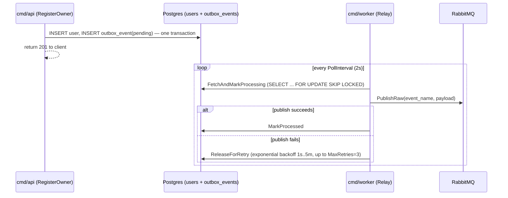

# identity-service — technical overview

Owns authentication, JWT issuance, and user (owner/customer) registration. Has its own Postgres database
(`identity_db`) and uses Redis; implements the outbox pattern.

## Responsibilities

- Register customers and restaurant owners.
- Email verification via one-time codes.
- Login/refresh/logout, issuing short-lived JWT access tokens and opaque refresh tokens.
- `GET /auth/verify` — a Traefik forward-auth target, not a client-facing route. Every request to another
  service passes through this first; on success Traefik injects `X-User-ID`/`X-User-Role` headers into the
  downstream request. Other services trust these headers instead of validating JWTs themselves.
- Reliably announce new restaurant owners to `restaurant-service` via the outbox pattern (see below).

## Layered architecture

```
cmd/api                   → Gin HTTP server (routes, middleware)
cmd/worker                → outbox relay poller — not started by compose.yaml, run manually
internal/domain           → User, auth (credential/token/verification), OutboxEvent — no framework deps
internal/application      → use cases: register_owner, register_customer, login, refresh, logout,
                             request_email_otp, verify_email, find_by_id; application/outbox (Relay)
internal/infrastructure   → GORM persistence, Redis refresh-token store, RabbitMQ publisher, JWT manager,
                             password hasher, OpenCage-independent (this service has no geocoding)
internal/interfaces/http  → Gin handlers, middleware, error mapping
internal/container        → shared.go (common deps) → api.go / worker.go
```

## Domain model

### `users` (Postgres)

| Column | Type | Notes |
|---|---|---|
| `id` | uuid PK | |
| `first_name`, `last_name` | varchar(255) | |
| `email` | varchar(255) unique | |
| `password` | varchar(255) | bcrypt hash |
| `role` | `user_role_enum` | `customer` \| `owner` \| `admin` — `admin` is schema-ready but has no registration flow; provisioned by direct DB insert only |
| `status` | `user_status_enum` | `active` \| `inactive` \| `suspended` — only `active` is ever set today |
| `phone` | varchar(32) | nullable, unused by any current registration path |
| `logged_at` | timestamptz | best-effort last-login stamp |
| `created_at`, `updated_at` | timestamptz | GORM-managed |

### `email_verifications` (Postgres)

One-time codes for signup. `email`, `code` (6 chars), `is_used`, `expires_at`, `created_at`. A code is single-use
and time-bound; state transitions are read by `internal/infrastructure/auth/email_verifier.go` into
`ErrCodeInvalid` / `ErrCodeExpired` / `ErrCodeUsed` / `ErrCodeNotIssued`.

### `outbox_events` (Postgres)

The transactional outbox. `id` (bigint identity), `aggregate_id`, `event_name`, `payload` (jsonb),
`status` (`pending` → `processing` → `processed` | `failed`), `attempts`, `locked_until`, `next_attempt_at`,
`last_error`, `created_at`, `processed_at`. Partial indexes support the worker's fetch pattern: pending rows
ordered by `next_attempt_at`, plus recovery/inspection indexes on `processing`/`failed` rows.

### Refresh tokens (Redis, not Postgres)

Key `refresh:<sha256(token)>` → JSON `UserClaims{UserID, Role}`, TTL 7 days. The raw token is only ever
returned to the client; the store holds only its hash. A genuine cache miss (never issued, or expired) maps to
`auth.ErrRefreshTokenInvalid` (401); a real Redis failure propagates as a 500 — these are deliberately not
collapsed into one error.

## The outbox pattern

Identity-service is the only service in the monorepo using this pattern, and only for one event:
`restaurant.initiated`. The reasoning: when an **owner** registers, a `Restaurant` record must reliably get
created downstream in `restaurant-service` — silently losing that event would leave an owner with no restaurant
to manage. `user.registered` and `email.verification_created` have no such hard downstream dependency, so they
are published directly/best-effort in the same request instead.



Batches of up to 50 rows are claimed per poll, processed with an internal concurrency of 5. A row that exceeds
`MaxRetries` (3) is marked `failed` and left for manual inspection — there is no dead-letter requeue for the
outbox (unlike the RabbitMQ-side DLX pattern used by restaurant-service/email-service consumers).

## Auth model

- **Access tokens**: stateless JWTs (`internal/infrastructure/security/jwt_manager.go`), carrying `user_id`/`role`.
- **Refresh tokens**: opaque random values, hashed before storage in Redis, looked up on `/auth/refresh`,
  deleted on `/auth/logout`.
- **Login** deliberately collapses "no such user" and "wrong password" into one generic `ErrUnauthorized` (401)
  — a client can't distinguish them, closing a user-enumeration side channel. A genuine backend failure (DB
  error) is a separate path that is not folded into the same response.
- **Duplicate-email registration** is rejected at OTP-request time (`RequestEmailOTP` checks
  `EmailExists` before issuing a code), not only at `Create` — `userRepo.Create` also translates a Postgres
  unique-violation as a race-safe backstop. This is the one endpoint in the service that leaks registration
  status (public, unauthenticated) — accepted as-is.

## Event flow

**Published:**
| Event | Mechanism | Consumed by |
|---|---|---|
| `restaurant.initiated` | outbox (guaranteed) | `restaurant-service` worker — creates the `Restaurant` row |
| `user.registered` | direct/best-effort | `email-service` — sends a role-based welcome email |
| `email.verification_created` | direct/best-effort | `email-service` — sends the OTP code email |

Identity-service consumes nothing — it has no inbound RabbitMQ consumer.

## Error convention

`internal/interfaces/http/response/error_response.go`'s `HandleError` is the single `errors.Is`-based dispatcher
from domain/shared error sentinels to HTTP status, covering `auth.ErrCode*`, `auth.ErrRefreshTokenInvalid`, the
shared sentinels (`ErrUnauthorized`, `ErrForbidden`, `ErrNotFound`, `ErrConflict`), and `user.ErrEmailAlreadyExists`.
Unhandled errors are logged and returned as a generic 500.

## Testing

Integration-style against real Postgres/Redis (`compose.test.yaml`, profile `test`) — no DB mocking. `tests/`
mirrors `internal/` 1:1; `tests/testutil/db.go`/`redis.go` provide singleton connections plus truncation/flush
helpers between tests; `tests/infrastructure/db/fixtures/` seeds known users for tests needing pre-existing data.
