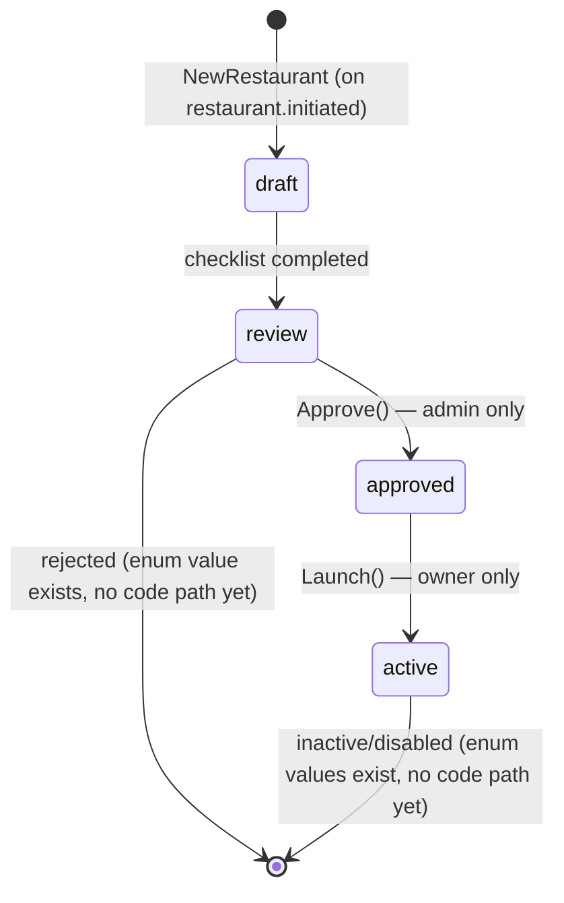
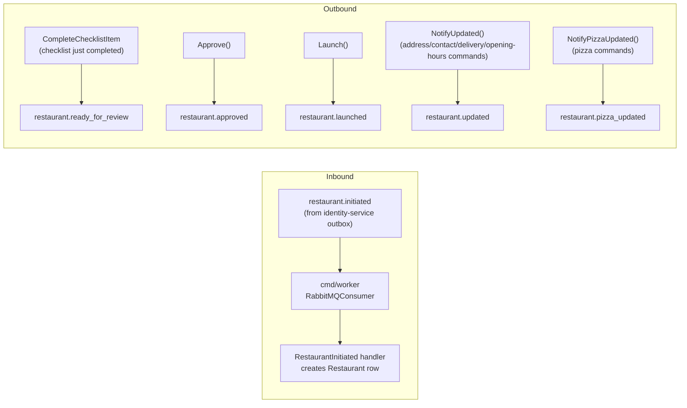

# restaurant-service — technical overview

Owns restaurant records, their onboarding checklist, and their menu (pizzas, toppings, pricing). The only
service with a Postgres database (`restaurant_db`) and the only caller of the OpenCage geocoding API. Does
**not** implement the outbox pattern — its `cmd/worker` is a plain RabbitMQ consumer, not an outbox relay.

## Layered architecture

```
cmd/api                         → Gin HTTP server
cmd/worker                      → RabbitMQ consumer for identity events — not started by compose.yaml, run manually
cmd/worker/bootstrap            → this service's app/runner setup (graceful shutdown, signal handling)
internal/domain/restaurant      → Restaurant aggregate, Checklist, OpeningHours, events, repository interface
internal/domain/payout          → PayoutDetails
internal/domain/pizza           → Pizza, PizzaPrice, PizzaSize
internal/domain/topping         → Topping, ToppingPrice
internal/application/restaurant → commands/, queries/ (ListPizzas), dispatch.go, mapper.go, schema.go, money.go
internal/application/payout     → CreatePayout, UpdatePayout
internal/application/pizza      → CreatePizza, UpdatePizza, SetPizzaPrices, ListPizzas
internal/application/topping    → SetToppingPrices
internal/infrastructure         → GORM persistence, RabbitMQ consumer, OpenCage geocoder, observability
internal/interfaces/http        → Gin handlers, X-User-ID/X-User-Role middleware (no local JWT parsing)
internal/container              → shared.go → api.go / worker.go
```

## Domain model

### `restaurants`

The central aggregate. Key columns beyond identity/name/VAT:

| Column | Type | Notes |
|---|---|---|
| `checklist` | jsonb | see Checklist below |
| `status` | `restaurant_status_enum` | see status workflow below |
| `address` | jsonb | `{house, street, postalCode, city}` |
| `lat`/`lon` | double precision | nullable, set by geocoding |
| `opening_hours` | jsonb | per-weekday list of `{open, close}` ranges, `HH:MM`, calendar-day-bound |
| `tags` | jsonb array | |
| `pickup`, `delivery_type`, `delivery_km`, `delivery_fee`, `minimum_order` | | delivery configuration |
| `currency` | char(3) | default `EUR` |
| `rating`, `total_reviews` | | unused by any write path yet |

`Restaurant.PayoutDetails` is a GORM has-one association (not a separate aggregate) — `FindByIDAndOwner`
preloads only the `active` row.

### Checklist

Six required items gate a restaurant's progression from `draft` to `review`: `basic`, `contact`, `address`,
`delivery`, `payout`, `openinghours`. Each is completed by its corresponding update command
(`RestaurantInitiated` sets `basic` on creation; `UpdateContact`/`UpdateAddress`/`UpdateDelivery`/`CreatePayout`/
`UpdateOpeningHours` set the rest). `Checklist.IsCompleted()` is currently only consulted by `CreatePizza`,
which 403s (`ErrChecklistIncomplete`) until the checklist is complete — pizza creation is gated on full
onboarding, restaurant status transitions are not (they're a separate mechanism, below).

### Restaurant status workflow



Only `Approve()` and `Launch()` are implemented today. `rejected`, `inactive`, and `disabled` exist in the
`restaurant_status_enum` and in `RestaurantStatus`'s Go constants, but nothing transitions into or out of them —
this is a deliberately partial state machine, matching this codebase's existing pattern of shipping a subset of
a documented design and flagging the gap explicitly rather than stubbing it.

### `payout_details`

Versioned, not overwritten in place — a separate table (own surrogate `id`, not keyed by `restaurant_id`) that
intentionally holds multiple historical rows per restaurant.

| Status | Meaning |
|---|---|
| `pending` | awaiting verification — every submission lands here first |
| `active` | currently receiving payouts |
| `superseded` | a former `pending`/`active` row that's been replaced |

Two partial unique indexes enforce at most one `active` and at most one `pending` row per restaurant at the DB
level. `Create` is a plain insert (a concurrent `pending` submission collides on the unique index →
`ErrPendingPayoutExists`); `UpdatePending` is an atomic conditional `UPDATE ... WHERE status = 'pending'`;
`PromoteToActive` (called by `Approve()`'s handler right after the status transition) is the same shape,
`WHERE status = 'pending'` → `active`. No code path ever mutates an `active`/`superseded` row after the fact.

### Menu: pizzas, sizes, toppings, prices

The menu is a set of separate aggregates, never embedded in the restaurant's own response — fetched via
`GET /:id/pizzas`, not nested.

| Table | Scope | Notes |
|---|---|---|
| `pizza_sizes` | global catalog | seeded by migration; `diameter_cm` unique, 20–45cm |
| `toppings` | global catalog | seeded by migration (12 rows); `name`, `description`, `is_vegetarian` — no price of its own |
| `pizzas` | restaurant-scoped | `status` (`available`/`unavailable`/`archived`), `sort_order`, `toppings` (jsonb array of topping IDs — see below) |
| `pizza_prices` | pizza+size scoped | `(pizza_id, size_id) → price`, `is_active` toggle |
| `topping_prices` | restaurant+topping scoped | `(restaurant_id, topping_id) → extra_price`, what a restaurant charges a customer to *add* a topping at order time |

**A pizza's default toppings are a JSONB array on `pizzas.toppings`, not a join table** — an earlier design used
a `pizza_topping_items` join table with FK integrity and a uniqueness constraint; it was replaced with a plain
`[]uuid` column plus two domain methods (`Pizza.ToppingIDs()`/`SetToppingIDs()`). This trades away DB-level
referential integrity for simplicity — existence-in-catalog is checked at the application layer
(`ValidateToppingSelections`), no-duplicates is enforced as a `Pizza` aggregate invariant
(`ErrDuplicateTopping`). A pizza's default toppings are unrelated to `topping_prices`: a default topping is
already priced into the pizza's own price, the same way mozzarella isn't a line item on a Margherita.

**No `DELETE` endpoint for pizzas** — `Pizza.Status` is the retirement mechanism (`archived` via
`PUT .../pizzaId`, filtered out of `ListPizzas` by default), to avoid orphaning a future order-history
reference. `pizza_prices.pizza_id` is `NO ACTION` on delete for the same reason (price history is never
implicitly cascaded away); `restaurants.id → pizzas.restaurant_id` is the one relationship that still cascades.

## Events



- **Inbound**: `restaurant.initiated`, consumed by `cmd/worker`'s `RabbitMQConsumer` → dispatched via an
  in-process `EventDispatcher` to the `RestaurantInitiated` handler, which creates the local `Restaurant` row.
  Reliability: manual ack, QoS prefetch 1, dead-letter exchange (`restaurant_dlx`), in-process retry via
  `x-retry-count` header (linear backoff, discard after 3 attempts). `Run`/`runOnce` are package-level functions
  taking a `messageSource` interface parameter rather than methods on `*RabbitMQConsumer`, specifically so tests
  can inject a fake source with no test-only production API surface.
- **Outbound**: `restaurant.ready_for_review` (consumed by `email-service`, notifies the admin inbox),
  `restaurant.approved` (consumed by `email-service`, notifies the restaurant's own contact email — the
  domain event denormalizes `Restaurant.Email` at the point `Approve()` fires, trusting the checklist
  invariant that `contact` is complete by then), `restaurant.launched` (a full restaurant+pizzas snapshot,
  composed in-process by `launch_restaurant.go`'s `Enricher`), `restaurant.updated` (fired by
  `Restaurant.NotifyUpdated()` after `UpdateAddress`/`UpdateContact`/`UpdateDelivery`/`UpdateOpeningHours`,
  guarded to `active`/`inactive` status only — no reindexing needed pre-launch). `restaurant.launched` and
  `restaurant.updated` are both consumed by `search-service`'s worker, which indexes/updates the restaurant
  in Elasticsearch; see `docs/services/search-service.md`. `restaurant.pizza_updated` (fired by
  `Restaurant.NotifyPizzaUpdated()` from `CreatePizza`/`UpdatePizza`/`SetPizzaPrices`, same status guard) is
  published but has **no consumer yet** — a future `search-service` handler needs to merge just the one
  changed pizza into the indexed document's menu array, not a whole-document replace; `SetToppingPrices`
  deliberately does not publish this event, since it never touches a specific `Pizza` row.
- **Event timestamps**: every domain event carries a single `OccurredAt time.Time` — when the domain method
  raised it, nothing more. `RestaurantLaunchedPayload`/`RestaurantUpdatedPayload` additionally carry their own
  `UpdatedAt`, sourced from the restaurant row's real GORM-managed write timestamp (`*r.UpdatedAt`), not from
  the event's `OccurredAt` — the two can differ by the gap between `NotifyUpdated()`/`Launch()` running and the
  subsequent `restaurantRepo.Update` actually persisting. `search-service`'s redelivery-ordering guard compares
  against `UpdatedAt` specifically, since it needs to reflect the real last-write time on the row, not when an
  in-memory event object happened to be constructed.

## Design notes worth knowing

- **`Money` wrapper type** (`internal/application/restaurant/money.go`): `decimal.Decimal.MarshalJSON()` trims
  trailing zeros (`1.50` → `"1.5"`), which is wrong for a price field. `Money` overrides marshal/unmarshal via
  `StringFixed(2)`. Scope: every *response* money field; request/input fields stay plain `decimal.Decimal`.
- **Auth**: this service never parses JWTs — it trusts `X-User-ID`/`X-User-Role` headers injected by Traefik
  after identity-service's forward-auth check succeeds.
- **Geocoding is conditional**: `UpdateAddress` only calls OpenCage when the address actually changed, reusing
  stored `Lat`/`Lon` otherwise (avoids unnecessary paid API calls).
- **Error convention**: shared sentinels (`ErrForbidden`, `ErrNotFound`, `ErrConflict`, `ErrInvalid`) plus
  domain-specific ones (`ErrPendingPayoutExists`, `ErrNoPendingPayout`, `ErrDuplicateTopping`), dispatched to
  HTTP status by `response.HandleError` — persistence/domain code never embeds user-facing text.

## Testing

Integration-style against real Postgres (`compose.test.yaml`). `tests/` mirrors `internal/`; fixtures cover
restaurants at varying checklist-completion states. One exception: `tests/infrastructure/messaging/` is a pure
unit test suite against `messaging.Run` with a fake message source — no DB or broker container needed for it.
