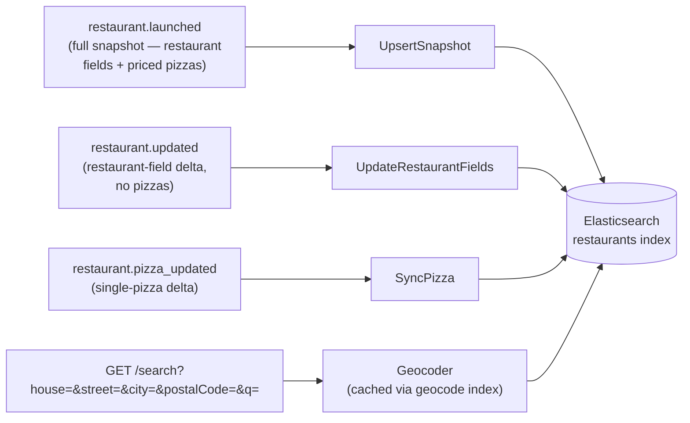

# search-service — technical overview

Read-only search API over restaurant/menu data, backed by Elasticsearch and kept fresh by consuming three
restaurant-service events off RabbitMQ: `restaurant.launched` (full snapshot on first index), `restaurant.updated`
(restaurant-field delta), and `restaurant.pizza_updated` (single-pizza delta). `restaurant.reactivated`/
`restaurant.deactivated` and a `Delete` repository method are still not built — restaurant-service doesn't publish
those yet (Part A's `Reactivate`/`Deactivate` remain unimplemented), so there's nothing to consume.

## Layered architecture

```
cmd/api                           → Gin HTTP server, GET /search only, no auth
cmd/worker                        → RabbitMQ consumer
cmd/worker/bootstrap              → app/runner setup (graceful shutdown, signal handling) — copied from
                                     restaurant-service's cmd/worker/bootstrap
internal/domain/index             → IndexedRestaurant, IndexedPizza, RestaurantFields, GeoPoint,
                                     SearchRepository, SearchQuery, Address, Geocoder, EventDispatcher,
                                     EventHandler, EventPayload — interfaces + plain data, no business logic
                                     of its own
internal/application/index        → UpsertSnapshot, UpdateRestaurantFields, SyncPizza (one handler per
                                     consumed event), EventDispatcher impl
internal/application/query        → SearchRestaurants (the /search use case — resolves address, then searches)
internal/infrastructure/elasticsearch → client wrapper, index_setup.go (EnsureIndex, both indices),
                                     search_repository.go, geocode_repository.go (CachingGeocoder)
internal/infrastructure/geocoder  → OpenCageGeocoder — search-service's own copy, independent of
                                     restaurant-service's (see "Geocoding" below)
internal/infrastructure/messaging → RabbitMQ consumer, copied from email-service's shape (the bug-fixed version —
                                     checks both conn and channel closed before reconnecting)
internal/infrastructure/observability → copied verbatim from restaurant-service (slog-based logger, Gin middleware)
internal/interfaces/http          → SearchHandler, routes.go — no middleware package at all, this API has no auth
internal/container                → api.go / worker.go
```

Unlike identity/restaurant/email-service, there is no database — `internal/infrastructure/` has no
`gorm`/`persistence`/`redis`/`auth`/migrations at all. There is a `compose.test.yaml` entry (`search-test` +
`elasticsearch-test`, same "needs a `-test` container" shape identity/restaurant use for Postgres), used by the
real-ES integration suite — see "Testing" below.

## Domain model

```go
type IndexedRestaurant struct {
    ID, Name, Slug, City string
    Location     GeoPoint // always present — see note below
    Currency     string
    Pickup       bool
    DeliveryType string
    DeliveryKm   *int16 // nil when DeliveryType is "none" — see "GET /search" below for what that means for matching
    Tags         []string
    Rating       float64
    TotalReviews int32
    Pizzas       []IndexedPizza
    UpdatedAt    time.Time // guards restaurant.updated redelivery — see "Events" below
}

type IndexedPizza struct {
    ID           uuid.UUID
    Name         string
    IsVegetarian bool
    Toppings     []string  // topping names, not IDs — this is a search document, not a menu-editing DTO
    UpdatedAt    time.Time // guards restaurant.pizza_updated redelivery, per-pizza — see "Events" below
}

// RestaurantFields is IndexedRestaurant minus Pizzas — restaurant.updated never carries menu data,
// so this type has no slot for it at all (not a shared struct with an ignored field).
type RestaurantFields struct {
    Name, Slug, City string
    Location     GeoPoint
    Currency     string
    Pickup       bool
    DeliveryType string
    DeliveryKm   *int16
    Tags         []string
    Rating       float64
    TotalReviews int32
    UpdatedAt    time.Time
}
```

All three domain structs (`IndexedRestaurant`, `IndexedPizza`, `GeoPoint`) carry explicit camelCase `json` tags,
matching every other response type in this repo — without them, Gin's default marshaling emits Go's capitalized
field names instead.

No `Price` field on `IndexedPizza` — this slice indexes for text/geo search, not for showing prices in results.

`Location` is a plain value, not a pointer — `restaurant-service`'s `Lat`/`Lon` are nullable `*float64` at the
domain/DB level (a `draft` restaurant that hasn't completed its `address` checklist item yet has neither), but
`UpdateAddress.Execute` (restaurant-service) requires successful geocoding before it marks the `address`
checklist item complete, and `address` gates `draft→review`, which gates every path to `active`. So `Lat`/`Lon`
are always set by the time `restaurant.launched` fires — this is a real guarantee from restaurant-service's own
checklist invariant, not an assumption. `UpsertSnapshot.Handle` still validates the incoming payload has both
before mapping it (an event crossing a service boundary is a validation point even when the source's own
invariant is solid) — a payload missing either is rejected outright rather than silently indexed with a
fabricated `(0,0)` location, which would be a real point in the ocean, not "unknown."

`SearchRepository`:

```go
type SearchRepository interface {
    UpsertSnapshot(ctx context.Context, r IndexedRestaurant) error
    UpdateFields(ctx context.Context, id uuid.UUID, fields RestaurantFields) error
    UpsertPizza(ctx context.Context, restaurantID uuid.UUID, pizza IndexedPizza) error
    RemovePizza(ctx context.Context, restaurantID, pizzaID uuid.UUID, updatedAt time.Time) error
    Search(ctx context.Context, q SearchQuery) ([]IndexedRestaurant, error)
}
```

`SearchQuery.Location` is a plain `GeoPoint`, not optional — every search resolves a customer address to
coordinates before querying (see "Geocoding" and "`GET /search`" below), so there's no "no location" case to
model. There's no `RadiusKm` on `SearchQuery` either — coverage is judged per-restaurant against its own
`DeliveryKm`, not a value the caller supplies.

`Delete` (the plan's method for pulling a restaurant back out of the index on `restaurant.deactivated`) is not
implemented — restaurant-service doesn't publish `deactivated`/`reactivated` yet, so it would have zero callers.

## Elasticsearch index

Two indices, both created (idempotently — checks existence first, no-ops if already there) by `EnsureIndex`,
called at both API and worker startup:

- **`restaurants`** — the search-facing index. `pizzas` is mapped as a plain object array, not `nested` —
  object-array fields flatten into multi-valued arrays (`pizzas.name`, `pizzas.toppings`), which a top-level
  `multi_match` can search directly with no `nested` query. Trade-off: this loses precise per-pizza cross-field
  matching (e.g. "vegetarian AND has pepperoni" could match two *different* pizzas on the same restaurant
  document rather than one pizza satisfying both) — accepted at this index's current scope, revisit if that
  precision is ever needed. `deliveryKm` is mapped `short` — see "`GET /search`" for how it's used. Both the
  top-level `updatedAt` and the nested `pizzas.updatedAt` are mapped `date` — two separate ordering guards (one
  per restaurant, one per pizza), not one shared field; see "Events" below for why a pizza edit can't reuse the
  restaurant-level guard.
- **`geocode`** — a disposable key/value cache for resolved addresses, unrelated to search. See "Geocoding"
  below.

## Geocoding

A customer shouldn't need to know their own coordinates, and `/search` filters by whether a restaurant can
actually deliver to them — both require resolving an address to `lat`/`lon`. `internal/infrastructure/geocoder/`
is search-service's **own** OpenCage client, independent of restaurant-service's — deliberately not shared code
(this repo duplicates per-service infrastructure rather than sharing a library across services, the same
pattern already used for the RabbitMQ consumer), and a deliberately separate cost/quota from
restaurant-service's own OpenCage usage.

Because OpenCage is a paid, rate-limited external API and `/search` can be hit far more often than a restaurant's
own address ever changes, geocoding is cached: `CachingGeocoder` (`internal/infrastructure/elasticsearch/geocode_repository.go`)
wraps the raw `OpenCageGeocoder` and checks the `geocode` index first. The cache key is a SHA-256 hash of the
normalized address (lowercased, whitespace-collapsed `house|street|city|postalCode`) — a cache hit costs one ES
point lookup (~5ms observed) instead of a network round-trip to OpenCage (~500ms+ observed); many customers
plausibly share an address (same street, same building), so the cache benefits more than just repeat searches
from the same person. A cache miss calls OpenCage, then writes the result before returning it.

`CachingGeocoder` has no unit tests, same reasoning as `SearchRepository`'s ES-backed methods — it's only
meaningfully testable against a real cluster (or a real OpenCage response), not mocked. Verified live instead —
see "Testing" below.

## Events



Each handler parses its event into a local, independent copy of restaurant-service's payload shape
(`restaurantLaunchedPayload`, `restaurantUpdatedPayload`, `pizzaUpdatedPayload`) — search-service never imports
restaurant-service's Go code, the two services only agree on the JSON wire contract. All three routing keys are
bound in `messaging.Exchanges["restaurant.events"]`; `restaurant.reactivated`/`restaurant.deactivated` are not,
since restaurant-service doesn't publish them yet.

- **`restaurant.launched`** (`internal/application/index/upsert_snapshot.go`) — restaurant-service composes the
  full snapshot in-process (`launch_restaurant.go`'s `Enricher`) and publishes it directly, so search-service
  never makes a synchronous call back into restaurant-service. `UpsertSnapshot.Handle` calls
  `SearchRepository.UpsertSnapshot`, which writes via a Painless-scripted `_update` carrying an `upsert:` body for
  the doc-doesn't-exist-yet case (first index) — the whole document is replaced only if the incoming `updatedAt`
  is strictly newer than what's already stored, otherwise the write is a no-op (`ctx.op = 'noop'`).
- **`restaurant.updated`** (`internal/application/index/update_restaurant_fields.go`) — fires on every
  post-launch edit to restaurant-level fields (address/contact/delivery/opening-hours; see restaurant-service's
  own doc for `NotifyUpdated()`'s call sites). `UpdateRestaurantFields.Handle` calls
  `SearchRepository.UpdateFields`, a field-by-field scripted update (deliberately **excluding** `pizzas` — a
  restaurant-field edit must never touch the indexed menu) guarded the same way, by the same top-level
  `updatedAt`. No `upsert:` fallback — a missing parent doc here is a contract violation (this event can only
  fire once `restaurant.launched` has already created it), so it 404s through to the consumer's DLX/retry path
  instead of silently creating a partial document.
- **`restaurant.pizza_updated`** (`internal/application/index/sync_pizza.go`) — fires on pizza create/update/
  price-change (see restaurant-service's own doc for exactly which commands publish it). `SyncPizza.Handle`
  checks the payload's pizza status and prices: archived or with no active price row (unsellable) routes to
  `SearchRepository.RemovePizza`; everything else routes to `SearchRepository.UpsertPizza`. Both do a **per-pizza**
  partial merge into the document's `pizzas` array (find-by-id, then replace-in-place-or-append / remove) via
  their own Painless scripts, guarded by that one pizza's own `pizzas[i].updatedAt` — **not** the restaurant-level
  `updatedAt` guard, since a pizza edit (e.g. a price-only change) never touches the `restaurants` row in
  restaurant-service, so the two timestamps are unrelated. Same no-`upsert:`-fallback contract as
  `UpdateFields`, and `RemovePizza` is additionally idempotent against a pizza that's already absent
  (`ctx.op = 'noop'` when not found, not an error) — redelivery-safe either way.

All three guards compare epoch milliseconds (`t.UnixMilli()` on the Go side, `Instant.parse(...).toEpochMilli()`
in Painless) via a strict `>`, entirely inside the scripted update — there's no read-then-write race between two
out-of-order deliveries, since ES applies the script atomically per document. This exists because RabbitMQ
redelivery can reorder messages: `Republish` (the consumer's retry path) re-sends a failed message to the *back*
of the queue with an incremented `x-retry-count`, while newer messages for the same restaurant/pizza get
processed in between — so a transient failure on an older event, followed by a newer one succeeding first, would
otherwise let the retried older event silently clobber the newer data once it's finally reprocessed.

## `GET /search`

Query params: `house`, `street`, `city`, `postalCode` (all **required** — a full delivery address, not raw
coordinates the caller has to already know), `q` (free text, optional — empty means "browse everything
deliverable to this address"). A request missing any address field is a `400`, not silently ignored. No auth —
public by design, matching the marketplace's core purpose. No `/health` route, matching restaurant-service's own
precedent (it has none either, unlike identity-service).

`SearchHandler` binds the address via `ShouldBindQuery` (`form` tags, `binding:"required"`), builds an
`index.Address`, and hands off to `SearchRestaurants.Execute`, which resolves it to `lat`/`lon` via the geocoder
(cached — see "Geocoding") before ever touching `SearchRepository`. A geocode failure (address doesn't resolve,
OpenCage unreachable) surfaces as a `500` — there's no fallback to an unscoped, address-less search.

**Coverage is decided by each restaurant's own delivery radius, not a caller-supplied one.** The query filters
with a Painless script comparing `doc['location'].arcDistance(customerLat, customerLon)` (meters) against
`doc['deliveryKm'].value * 1000` — a restaurant with no `deliveryKm` set (`DeliveryType: "none"`) is excluded
outright, on the theory that "no delivery configured" shouldn't default to "unlimited range." Pickup-only
restaurants (`Pickup: true` with no delivery configured) are a known gap: they never match any address-scoped
search today, even though a customer might reasonably want to find them for pickup regardless of distance. Not
addressed in this slice.

Within whatever passes that filter, relevance is not plain keyword matching:

- **Typo tolerance**: the `multi_match` query carries `"fuzziness": "AUTO"` across `name`/`pizzas.name`/
  `pizzas.toppings`, so e.g. `q=Pizzeriaa` still matches `Pizzeria Roma`.
- **Rating boost**: results are wrapped in a `function_score` query — `field_value_factor` on `rating` with a
  `log1p` modifier, `boost_mode: "sum"` (added to, not multiplied against, the text-match score, so a 4.9-rated
  restaurant with a weak text match still can't outrank a 3.2-rated restaurant with a strong one) and
  `"missing": 0` (an unrated restaurant gets no boost rather than being penalized).

Ranking stays relevance+rating even after the delivery-range filter narrows the candidate set — every remaining
hit can already reach the customer, so which one is a few hundred meters closer matters less than which one
actually matches what they're looking for. (An earlier version of this endpoint took raw `lat`/`lon`/`radiusKm`
and sorted geo-scoped results by distance; that was replaced by the address-required, delivery-radius-filtered
design described here.)

## Testing

Mixed, not uniform: `tests/application/index/` and `tests/application/query/` mock `SearchRepository` via a
shared `tests/testutil.MockSearchRepository` (matches email-service's plain-unit-test approach, no
infrastructure needed) — one test file per handler (`upsert_snapshot_test.go`, `update_restaurant_fields_test.go`,
`sync_pizza_test.go`). `tests/interfaces/http/handlers/` builds the real `SearchRestaurants` use case over that
same mock and drives the handler through `httptest`, the same pattern restaurant-service's handler tests use
(real use case, faked boundary dependency), just without a real DB behind it.

`tests/infrastructure/elasticsearch/search_repository_test.go`, though, is a **real**-Elasticsearch integration
suite — `toESRestaurant`/`fromESRestaurant`/the Painless scripts are only meaningfully testable against a real
cluster, not mocked. It runs against the `compose.test.yaml` `elasticsearch-test` service and must execute
*inside* the `search-test` container (its `.env.test` uses docker-network-only hostnames), the same
"needs a `-test` container" shape as identity/restaurant's Postgres-backed tests. Covers both ordering guards
per event type (`UpsertSnapshot`/`UpdateFields`/`UpsertPizza`/`RemovePizza`, each with a stale-redelivery-ignored
case), the pizzas-preserved-through-a-field-only-update case, and the document-missing-404 case for
`UpdateFields`/`UpsertPizza`/`RemovePizza`'s no-`upsert:`-fallback contract. `tests/testutil.ES(t)` resets both
indices before each test; `RefreshIndex` forces visibility (ES's ~1s near-realtime refresh would otherwise hide a
just-written doc from an immediate assertion).

End-to-end path verified manually against a live stack (elasticsearch, rabbitmq, search-service, search-worker),
including a real OpenCage account (search-service's own key, `OPENCAGE_API_KEY`): `restaurant.launched` messages
published to the `restaurant.events` exchange are indexed by the worker; `GET /search` with a real Hamburg
address resolves via OpenCage, hits the restaurant within its 10km delivery radius (name match, empty-`q`
browse-all, and rating-boosted ordering all confirmed), and a Berlin address (~250km away, outside that radius)
correctly returns no results. Cache behavior confirmed via request timing: a first search from a new address
took ~540ms (real OpenCage call); an identical repeat search took ~5ms (`geocode` index hit, no external call).
Typo/fuzzy matching was also confirmed separately against synthetic data. `search-service` is not host-exposed,
same as every other service in this repo — only reachable through Traefik.

While standing up this stack, `search-service` hit the same Traefik network-IP-pinning bug already documented for
`identity-service` (see the root-level compose infra notes) — Traefik advertised the `internal`-network IP
instead of `backend` despite the correct `traefik.docker.network=backend` label. Notably, restarting/recreating
the `search-service` container itself did **not** fix it this time; only restarting the `traefik` container did.
Worth checking both remedies if this recurs on a third service.
